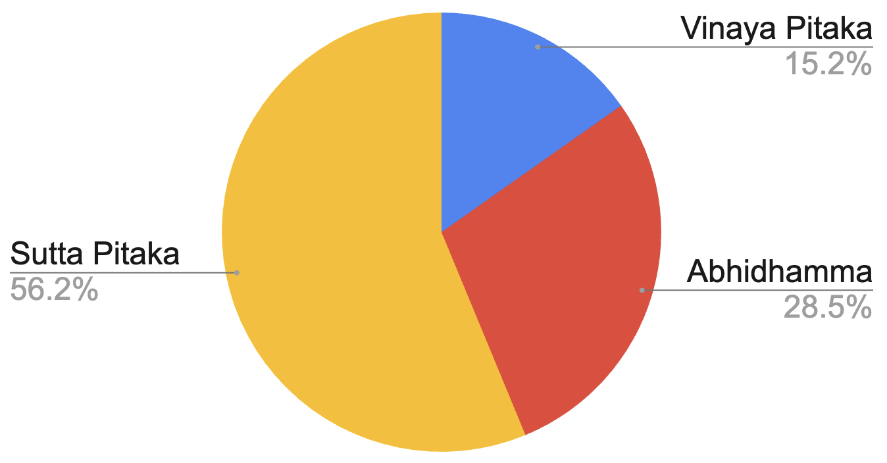

# Tripitaka

Make the text of the Tripitaka searchable for phrases and statistics. And compare to the bible.

### Bible

- 66 books (5.2 MByte in 66 JSON files, from [Arul John](https://github.com/aruljohn/Bible-kjv))
- 1,189 chapters
- 31,102 verses
- 35,049 sentences
- 790,573 words
- 3,223,201 characters
- 1062 pages if printed 80x50 per page (Consolas 11pt on A4 with 17/19mm border - 4.3 MByte as text file)

### Tripitaka

The three Baskets in the [Pali edition](https://github.com/suttacentral/bilara-data):

- Vinaya Piṭaka has 454 JSON items in 18 folders that combined need 6.7 MByte
- Sutta Piṭaka has 5741 JSON items in 110 folders that combined need 22.8 MByte
- Abhidhamma Piṭaka has 1110 JSON items in 64 folders, combined 11.2 MByte

Combined thats 40.7 MByte and roughly 10x larger than the KJV project. There is some JSON overhead and filesize to consider, but probably soon these files can be automatially parsed and at least for Pali a size estimation be generated. 7288 json files in 192 folders.

Another size comparison source: [The Vipassana Research Institute (VRI)](https://www.vridhamma.org/Tipitaka-Project) in India states that the Tripitaka makes up 24 million characters. My count on KJV revealed 3.2 million. So the order of magnitude seems correct.

The above graph was created based on the used tablets used for the baskets in the [largest book of the world with 729 tablets](https://en.wikipedia.org/wiki/Tripi%E1%B9%ADaka_tablets_at_Kuthodaw_Pagoda) in Mandalay. It assumes that the content of each of the tablets is roughly the same.

- Vinaya Piṭaka 111 tablets
- Sutta Pitaka - 410 tablets (for DN, MN, SN (65), AN(78), KN(169))
- Abhidhamma Piṭaka - 208 tablets

A python script run will hopefully give some further insight into the size of the Tipitaka similar to the KJV above from 2024/05/01.

- Vinaya Piṭaka, Sutta Piṭaka and Abhidhamma Piṭaka (incomplete JSON 108 MByte in 2218 files from [whizsid/tripitaka-api](https://github.com/whizsid/tripitaka-api))
- 15 (5 + 3 + 7) nikayas (collections) of suttas
- ? verses/suttras
- ? paragraphs
- ? sentences
- ? words
- ? characters
- ? pages if printed 80x25 per page

In detail that is:
- Vinaya Piṭaka (_Basket of Discipline_)
  - Suttavibhaṅga
  - Khandhaka
  - Parivāra (19 chapters)
- Sutra Pitaka - 5 Nikāyas - 34 + 152/222 + 2854/7762 + 169/186 + (15/18 books) suttras
  - Dīgha Nikāya ("Collection of Long Discourses") - 34 suttras
    - Silakkhandha-vagga—The Division Concerning Morality (suttas 1-13)
    - Maha-vagga—The Great Division (suttas 14-23)
    - Patika-vagga—The Patika Division (suttas 24-34)
  - Majjhima Nikāya ("Collection of Middle-length Discourses") - 152 or 222 suttras
    - 222 sūtras (Sarvāstivāda school), 152 suttas in the Pāli Majjhima Nikāya
  - Saṃyutta Nikāya ("Connected Discourses" or "Kindred Sayings") - 2854 to 7762 suttras
    - Burmese edition: 2854 suttras
    - Pali Text Society edition: 2889 suttras
    - Bhikkhu Bodhi in his translation: 2904
    - Rupert Gethin: 6696 suttras
    - Sinhalese edition: 7656 suttras
    - Bodhi commentaries: 7762 suttras
    - The suttas/sūtras are grouped into five vargas/vaggas, or sections. Each varga/vagga is further divided into samyuttas/saṃyuktas, or chapters:
      - Sagatha-vagga (SN1-11)
      - Nidana-vagga (SN12-21)
      - Khandha-vagga (SN22-34)
      - Salayatana-vagga (SN35-44)
      - Maha-vagga
        - SN 45 the Noble Eightfold Path
        - SN 46 the Seven Factors of Enlightenment
        - SN 47 the Four Establishment of Mindfulness
        - SN 48 the Faculties
        - SN 49 the Four Right Striving
        - SN 50 the Five Powers
        - SN 51-55
        - SN 56 the Truths
  - Aṅguttara Nikāya (aṅguttaranikāya; lit. 'Increased-by-One Collection', also translated "Gradual Collection" or "Numerical Discourses") - 11 nipatos, 186 or 169 or thousands os suttras
    - Ekakanipāto (The Book of Ones) 20 suttras?
    - Dukanipāto (The Book of Twos) 19
    - Tikanipāto (The Book of Threes) 18
    - Catukkanipāto (The Book of Fours) 28
    - Pañcakanipāto (The Book of Fives) 29
    - Chakkanipāto (The Book of Sixes) 13
    - Sattakanipāto (The Book of Sevens) 11
    - Aṭṭhakanipāto (The Book of Eights) 11
    - Navakanipāto (The Book of Nines) 10
    - Dasakanipāto (The Book of Tens) 23
    - Ekādasako nipāto (The Book of Elevens) 4
  - Khuddaka Nikāya (lit. 'Minor Collection') - 15 to 18 books
    - Khuddakapatha (Pali for "short passages") - 9 discourses
    - Dhammapada - 423 verses in 26 chapters, most widely read
    - Udana - 8 chapters, 80 utterances
    - Itivuttaka - 112 short teachings
    - Sutta Nipata - 5 sections, 70 suttas
      - Uraga Vagga ("The Chapter on the Serpent") - 12 suttas
      - Cūla Vagga ("The Minor Chapter") - 14 suttas
      - Mahā Vagga ("The Great Chapter") - 12 suttas
      - Atthaka Vagga "The Chapter of Octads" - 16 suttas
      - Parayana Vagga ("The Chapter on the Way Beyond") - 16 suttas
    - Vimanavatthu - 83 short stories
    - Petavatthu - 51 verses, hungry ghost realm?
    - Theragatha (Verses of the Elder Monks) - 264 poems, 21 chapters, 1279 verses (claim: 1360)
    - Therigatha (Verses of the Elder Nuns) - 73 poems, 16 chapters, 494 verses
    - Jataka - 550 fables that should teach virtues, but taken literal
    - Niddesa - two commentaries by Sariputta: Maha Niddesa on the Atthaka Vagga, Cula Niddesa on the Parayana Vagga and Khaggavisana Sutta
    - Patisambhidamagga - 30 chapters, first about knowledge
    - Apadana - 589-603 poems
    - Buddhavamsa (also known as the Chronicle of Buddhas) - 29 chapters - 24/28 Buddhas that preceded Gautama several billion years ago, some while riding on an elephant, being 26 meters large and having a stupa 307 km high ([Anomadassi](https://en.wikipedia.org/wiki/Anomadassi)) and living 100,000 years ([Tissa](https://en.wikipedia.org/wiki/Tissa_Buddha)) and having 6.8 million disciples ([Vipassī](https://en.wikipedia.org/wiki/Vipassī))
    - Cariyapitaka - 35 stories, spanning 356 to 371 verses
    - Nettipakarana or Netti (included in Burmese and Sinhalese editions, but not in Thai edition) - 2 divisions, 3 subsections, with 16 hāras, 5 naya and 18 mūlapadas, repeated in second subsection, expanded in third
    - Petakopadesa (included in Burmese and Sinhalese editions, but not in Thai edition) - 8 sections
    - Milindapañha (lit. 'Questions of Milinda', included in Burmese edition, but not in Sinhalese and Thai editions) - 2 volumes?
- Abhidhamma Piṭaka (_Basket of Higher Doctrine_) - 7 books
  - Dhammasaṅgaṇī (-saṅgaṇi or -saṅgaṇī)
  - Vibhaṅga (vibhaṅga)
  - Dhātukathā (dhātukathā)
  - Puggalapaññatti (-paññatti)
  - Kathāvatthu (kathā-)
  - Yamaka
  - Paṭṭhāna (paṭṭhāna)

## Sources

Similar projects have been done with the bible and having all 1189 chapters in JSON files, like [this one from Arul John](https://github.com/aruljohn/Bible-kjv) of the King James version.

## Tripitaka sources

- [tripitaka.online](https://tripitaka.online/) only in Sinhala
- [suttacentral](https://suttacentral.net/?lang=en) by [Bhante Sujato](https://en.wikipedia.org/wiki/Bhante_Sujato) in English, [Pali from VRI](https://discourse.suttacentral.net/t/what-is-the-difference-between-the-pali-text-of-the-vri-and-that-of-the-mahasa-giti/2667)
- [theravada.vn](https://theravada.vn/tipitaka-english/) Vietnamese site with 541 English, 2722 Roman and 2034 Vietnamese suttras

