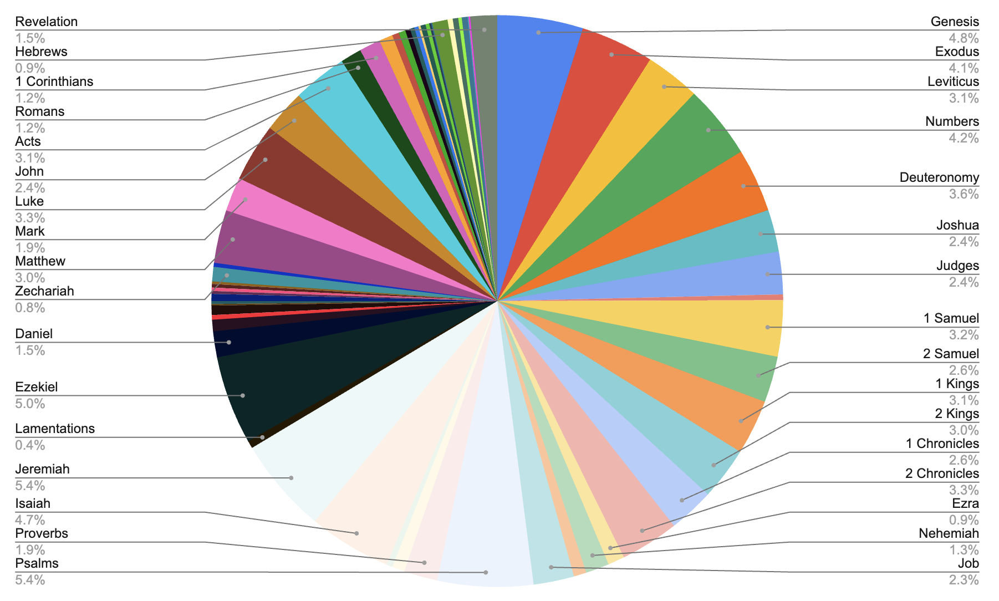

# Tripitaka

Make the text of the Tripitaka searchable for phrases and statistics. And compare the results to the bible.

## Bible in the King James version

- 66 books (5.2 MByte in 66 JSON files, from [Arul John](https://github.com/aruljohn/Bible-kjv))
- 1,189 chapters
- 31,102 verses
- 35,049 sentences
- 790,573 words
- 3,223,201 characters
- 1062 pages if printed 80x50 per page (Consolas 11pt on A4 with 17/19mm border - [4.3 MByte as text file](https://raw.githubusercontent.com/kreier/tripitaka/main/python/kjv.txt))

## Tripitaka in the Pali version by the [The Vipassana Research Institute (VRI)](https://www.vridhamma.org/Tipitaka-Project)

The structure of the Tripitaka is more diverse and not as uniform as in the bible. A parsing run over the 7288 json files from the [Pali edition](https://github.com/suttacentral/bilara-data) resulted in the following statistics:

- 2,782 books
- 5,273 chapters
- 99,567 verses
- 481,994	sentences - 13.8x kjv
- 3,007,818 words - 3.8x kjv
- 22,439,824 characters or letters - 6.9x kjv
- 7,013 pages if printed 80x50 per page (Consolas 11pt on A4 with 17/19mm border - 31.4 MByte as text file, 6.6x kjv)

In detail for the three Baskets this results in :

- Vinaya Piṭaka has 412 books with 450,529 words on 1039 pages, [4.7 MByte textfile](https://raw.githubusercontent.com/kreier/tripitaka/main/python/tripitaka_vinaya.txt)
- Sutta Piṭaka has 2289 books with 1,692,792 words on 3872 pages, [17.2 MByte textfile](https://raw.githubusercontent.com/kreier/tripitaka/main/python/tripitaka_sutta.txt)
- Abhidhamma Piṭaka has 81 books with 864,497 words on 2102 pages, [9.5 MByte textfile](https://raw.githubusercontent.com/kreier/tripitaka/main/python/tripitaka_abhidhamma.txt)

|                   | books | chapters | verses | sentences |   words   | characters | pages |    size    |
|-------------------|:-----:|:--------:|:------:|:---------:|:---------:|:----------:|:-----:|:----------:|
| Vinaya Piṭaka     |   412 |        8 |  4,259 |    73,833 |   450,529 |  3,363,421 | 1,039 |  4.7 MByte |
| Abhidhamma Piṭaka |    81 |     1021 | 42,558 |   118,211 |   864,497 |  6,884,073 | 2,102 |  9.5 MByte |
| Sutta Pitaka      |  2289 |     4244 | 52,750 |   289,950 | 1,692,792 | 12,192,330 | 3,872 | 17.2 MByte |
| sum               |  2782 |     5273 | 99,567 |   481,994 | 3,007,818 | 22,439,824 | 7,013 | 31.4 MByte |

Combined thats 31.4 MByte and roughly 7x larger than the KJV project. This version is stored in 7288 json files in 192 folders and has 22 million characters counted. More details further down below.

Another size comparison source: [The Vipassana Research Institute (VRI)](https://www.vridhamma.org/Tipitaka-Project) in India states that the Tripitaka makes up 24 million characters. My count on KJV revealed 3.2 million. So the order of magnitude seems correct.

The above graph was created based on the used tablets used for the baskets in the [largest book of the world with 729 tablets](https://en.wikipedia.org/wiki/Tripi%E1%B9%ADaka_tablets_at_Kuthodaw_Pagoda) in Mandalay. It assumes that the content of each of the tablets is roughly the same.

- Vinaya Piṭaka 111 tablets
- Sutta Pitaka - 410 tablets (for DN, MN, SN (65), AN(78), KN(169))
- Abhidhamma Piṭaka - 208 tablets

A python script run will hopefully give some further insight into the size of the Tipitaka similar to the KJV above from 2024/05/01.

In more detail these 3 baskets contain:

### [Vinaya Piṭaka](https://en.wikipedia.org/wiki/Vinaya_Pi%E1%B9%ADaka) (_Basket of Discipline_)

- [Suttavibhaṅga](https://en.wikipedia.org/wiki/Suttavibhanga): [Pāṭimokkha](https://en.wikipedia.org/wiki/P%C4%81%E1%B9%ADimokkha) and commentary
  - Mahāvibhaṅga: 227 rules for fully ordained monks ([bhikkhus](https://en.wikipedia.org/wiki/Bhikkhu))
  - Bhikkhunīvibhaṅga: 311 (348 Dharmaguptaka, 364 Mulasarvastivada) rules for nuns ([bhikkhuṇīs](https://en.wikipedia.org/wiki/Bhikkhun%C4%AB))
- [Khandhaka](https://en.wikipedia.org/wiki/Khandhaka) 22 chapters on various topics
- [Parivāra](https://en.wikipedia.org/wiki/Pariv%C4%81ra) 19 chapters with analyses of rules from various points of view

### [Sttra Pitaka](https://en.wikipedia.org/wiki/Sutta_Pi%E1%B9%ADaka) - 5 Nikāyas - 34 + 152/222 + 2854/7762 + 169/186 + (15/18 books) suttras

#### Dīgha Nikāya ("Collection of Long Discourses") - 34 suttras

- Silakkhandha-vagga—The Division Concerning Morality (suttas 1-13)
- Maha-vagga—The Great Division (suttas 14-23)
- Patika-vagga—The Patika Division (suttas 24-34)

#### Majjhima Nikāya ("Collection of Middle-length Discourses") - 152 or 222 suttras

- 222 sūtras (Sarvāstivāda school), 152 suttas in the Pāli Majjhima Nikāya

#### Saṃyutta Nikāya ("Connected Discourses" or "Kindred Sayings") - 2854 to 7762 suttras

- Burmese edition: 2854 suttras
- Pali Text Society edition: 2889 suttras
- Bhikkhu Bodhi in his translation: 2904
- Rupert Gethin: 6696 suttras
- Sinhalese edition: 7656 suttras
- Bodhi commentaries: 7762 suttras
- The suttas/sūtras are grouped into five vargas/vaggas, or sections. Each varga/vagga is further divided into samyuttas/saṃyuktas, or chapters:
  - Sagatha-vagga (SN1-11)
  - Nidana-vagga (SN12-21)
  - Khandha-vagga (SN22-34)
  - Salayatana-vagga (SN35-44)
  - Maha-vagga
    - SN 45 the Noble Eightfold Path
    - SN 46 the Seven Factors of Enlightenment
    - SN 47 the Four Establishment of Mindfulness
    - SN 48 the Faculties
    - SN 49 the Four Right Striving
    - SN 50 the Five Powers
    - SN 51-55
    - SN 56 the Truths

#### Aṅguttara Nikāya (aṅguttaranikāya; lit. 'Increased-by-One Collection', also translated "Gradual Collection" or "Numerical Discourses") - 11 nipatos, 186 or 169 or thousands os suttras

- Ekakanipāto (The Book of Ones) 20 suttras?
- Dukanipāto (The Book of Twos) 19
- Tikanipāto (The Book of Threes) 18
- Catukkanipāto (The Book of Fours) 28
- Pañcakanipāto (The Book of Fives) 29
- Chakkanipāto (The Book of Sixes) 13
- Sattakanipāto (The Book of Sevens) 11
- Aṭṭhakanipāto (The Book of Eights) 11
- Navakanipāto (The Book of Nines) 10
- Dasakanipāto (The Book of Tens) 23
- Ekādasako nipāto (The Book of Elevens) 4

#### Khuddaka Nikāya (lit. 'Minor Collection') - 15 to 18 books

- Khuddakapatha (Pali for "short passages") - 9 discourses
- Dhammapada - 423 verses in 26 chapters, most widely read
- Udana - 8 chapters, 80 utterances
- Itivuttaka - 112 short teachings
- Sutta Nipata - 5 sections, 70 suttas
  - Uraga Vagga ("The Chapter on the Serpent") - 12 suttas
  - Cūla Vagga ("The Minor Chapter") - 14 suttas
  - Mahā Vagga ("The Great Chapter") - 12 suttas
  - Atthaka Vagga "The Chapter of Octads" - 16 suttas
  - Parayana Vagga ("The Chapter on the Way Beyond") - 16 suttas
- Vimanavatthu - 83 short stories
- Petavatthu - 51 verses, hungry ghost realm?
- Theragatha (Verses of the Elder Monks) - 264 poems, 21 chapters, 1279 verses (claim: 1360)
- Therigatha (Verses of the Elder Nuns) - 73 poems, 16 chapters, 494 verses
- Jataka - 550 fables that should teach virtues, but taken literal
- Niddesa - two commentaries by Sariputta: Maha Niddesa on the Atthaka Vagga, Cula Niddesa on the Parayana Vagga and Khaggavisana Sutta
- Patisambhidamagga - 30 chapters, first about knowledge
- Apadana - 589-603 poems
- Buddhavamsa (also known as the Chronicle of Buddhas) - 29 chapters - 24/28 Buddhas that preceded Gautama several billion years ago, some while riding on an elephant, being 26 meters large and having a stupa 307 km high ([Anomadassi](https://en.wikipedia.org/wiki/Anomadassi)) and living 100,000 years ([Tissa](https://en.wikipedia.org/wiki/Tissa_Buddha)) and having 6.8 million disciples ([Vipassī](https://en.wikipedia.org/wiki/Vipassī))
- Cariyapitaka - 35 stories, spanning 356 to 371 verses
- Nettipakarana or Netti (included in Burmese and Sinhalese editions, but not in Thai edition) - 2 divisions, 3 subsections, with 16 hāras, 5 naya and 18 mūlapadas, repeated in second subsection, expanded in third
- Petakopadesa (included in Burmese and Sinhalese editions, but not in Thai edition) - 8 sections
- Milindapañha (lit. 'Questions of Milinda', included in Burmese edition, but not in Sinhalese and Thai editions) - 2 volumes?

#### Abhidhamma Piṭaka (_Basket of Higher Doctrine_) - 7 books
  - Dhammasaṅgaṇī (-saṅgaṇi or -saṅgaṇī)
  - Vibhaṅga (vibhaṅga)
  - Dhātukathā (dhātukathā)
  - Puggalapaññatti (-paññatti)
  - Kathāvatthu (kathā-)
  - Yamaka
  - Paṭṭhāna (paṭṭhāna)

# More details in comparison

## King-James-Bible

Since I have the complete bible in well organized and structured 66 JSON files available it was a question of a few hours to get some statistics out of it. Let's start with a visualization of the size of the 66 books - some smaller ones are not labeled:

We can now break down each book into the number of chapteres, verses, sentences, words, characters and pages needed in a print:

| book            | chapters | verses | sentences | words  | letters | pages |
|-----------------|----------|--------|-----------|--------|---------|-------|
| Genesis         |       50 |  1,533 |     1,716 | 38,290 | 151,857 |    50 |
| Exodus          |       40 |  1,213 |     1,288 | 32,695 | 131,775 |    43 |
| Leviticus       |       27 |    859 |       872 | 24,546 |  98,922 |    33 |
| Numbers         |       36 |  1,288 |     1,349 | 32,928 | 137,901 |    45 |
| Deuteronomy     |       34 |    959 |       999 | 28,387 | 114,018 |    37 |
| Joshua          |       24 |    658 |       699 | 18,862 |  78,372 |    26 |
| Judges          |       21 |    618 |       753 | 18,985 |  76,851 |    25 |
| Ruth            |        4 |     85 |       114 |  2,577 |  10,000 |     4 |
| 1 Samuel        |       31 |    810 |     1,065 | 25,066 | 100,211 |    33 |
| 2 Samuel        |       24 |    695 |       915 | 20,620 |  82,497 |    27 |
| 1 Kings         |       22 |    816 |       951 | 24,538 |  98,713 |    32 |
| 2 Kings         |       25 |    719 |       943 | 23,538 |  93,631 |    31 |
| 1 Chronicles    |       29 |    942 |     1,054 | 20,383 |  86,625 |    29 |
| 2 Chronicles    |       36 |    822 |       934 | 26,093 | 109,303 |    35 |
| Ezra            |       10 |    280 |       294 |  7,445 |  31,705 |    11 |
| Nehemiah        |       13 |    406 |       466 | 10,489 |  44,705 |    14 |
| Esther          |       10 |    167 |       205 |  5,645 |  23,748 |     8 |
| Job             |       42 |  1,070 |     1,230 | 18,149 |  73,266 |    24 |
| Psalms          |      150 |  2,461 |     2,664 | 42,727 | 173,959 |    58 |
| Proverbs        |       31 |    915 |       946 | 15,046 |  62,676 |    21 |
| Ecclesiastes    |       12 |    222 |       242 |  5,588 |  21,972 |     7 |
| Song of Solomon |        8 |    117 |       134 |  2,666 |  10,548 |     4 |
| Isaiah          |       66 |  1,292 |     1,474 | 37,086 | 150,992 |    50 |
| Jeremiah        |       52 |  1,364 |     1,564 | 42,720 | 174,386 |    57 |
| Lamentations    |        5 |    154 |       166 |  3,421 |  14,173 |     4 |
| Ezekiel         |       48 |  1,273 |     1,364 | 39,423 | 160,049 |    53 |
| Daniel          |       12 |    357 |       384 | 11,605 |  48,438 |    16 |
| Hosea           |       14 |    197 |       215 |  5,178 |  21,122 |     7 |
| Joel            |        3 |     73 |        78 |  2,035 |   8,359 |     2 |
| Amos            |        9 |    146 |       173 |  4,220 |  16,989 |     6 |
| Obadiah         |        1 |     21 |        25 |    674 |   2,823 |     1 |
| Jonah           |        4 |     48 |        62 |  1,321 |   5,087 |     1 |
| Micah           |        7 |    105 |       124 |  3,155 |  12,719 |     5 |
| Nahum           |        3 |     47 |        56 |  1,286 |   5,423 |     1 |
| Habakkuk        |        3 |     56 |        71 |  1,484 |   6,217 |     2 |
| Zephaniah       |        3 |     53 |        55 |  1,620 |   6,643 |     3 |
| Haggai          |        2 |     38 |        46 |  1,130 |   4,400 |     1 |
| Zechariah       |       14 |    211 |       239 |  6,445 |  25,549 |     8 |
| Malachi         |        4 |     55 |        87 |  1,782 |   7,125 |     3 |
| Matthew         |       28 |  1,071 |     1,221 | 23,717 |  96,656 |    32 |
| Mark            |       16 |    678 |       777 | 15,192 |  61,338 |    20 |
| Luke            |       24 |  1,151 |     1,310 | 25,999 | 104,336 |    35 |
| John            |       21 |    879 |     1,034 | 19,146 |  75,533 |    25 |
| Acts            |       28 |  1,007 |     1,099 | 24,277 | 101,726 |    33 |
| Romans          |       16 |    433 |       536 |  9,454 |  39,320 |    13 |
| 1 Corinthians   |       16 |    437 |       528 |  9,474 |  37,943 |    13 |
| 2 Corinthians   |       13 |    257 |       287 |  6,089 |  24,982 |     8 |
| Galatians       |        6 |    149 |       162 |  3,092 |  12,652 |     4 |
| Ephesians       |        6 |    155 |       158 |  3,030 |  12,832 |     5 |
| Philippians     |        4 |    104 |       111 |  2,185 |   9,031 |     3 |
| Colossians      |        4 |     95 |       100 |  1,983 |   8,422 |     2 |
| 1 Thessalonians |        5 |     89 |        92 |  1,837 |   7,543 |     3 |
| 2 Thessalonians |        3 |     47 |        49 |  1,024 |   4,277 |     1 |
| 1 Timothy       |        6 |    113 |       119 |  2,251 |  10,068 |     3 |
| 2 Timothy       |        4 |     83 |        89 |  1,667 |   7,246 |     3 |
| Titus           |        3 |     46 |        52 |    898 |   4,067 |     1 |
| Philemon        |        1 |     25 |        26 |    430 |   1,817 |     1 |
| Hebrews         |       13 |    303 |       319 |  6,915 |  29,336 |     9 |
| James           |        5 |    108 |       134 |  2,307 |   9,433 |     3 |
| 1 Peter         |        5 |    105 |       116 |  2,478 |  10,589 |     4 |
| 2 Peter         |        3 |     61 |        66 |  1,557 |   6,940 |     2 |
| 1 John          |        5 |    105 |       126 |  2,519 |   9,848 |     3 |
| 2 John          |        1 |     13 |        17 |    298 |   1,204 |     1 |
| 3 John          |        1 |     14 |        18 |    294 |   1,250 |     0 |
| Jude            |        1 |     25 |        27 |    609 |   2,812 |     1 |
| Revelation      |       22 |    404 |       460 | 12,003 |  48,251 |    16 |

## Pali edition of the Tripitaka

We can now break down each basket into the number of chapteres, verses, sentences, words, characters and pages needed in a print:

|                   | json | folders | books | chapters | verses | sentences |   words   | characters | pages | html fix |    size    |
|-------------------|:----:|:-------:|:-----:|:--------:|:------:|:---------:|:---------:|:----------:|:-----:|:--------:|:----------:|
| Vinaya Piṭaka     |  422 |      18 |   412 |        8 |  4,259 |    73,833 |   450,529 |  3,363,421 | 1,039 |        0 |  4.7 MByte |
| Abhidhamma Piṭaka | 1102 |      64 |    81 |     1021 | 42,558 |   118,211 |   864,497 |  6,884,073 | 2,102 |     1816 |  9.5 MByte |
| Sutta Pitaka      | 5749 |     110 |  2289 |     4244 | 52,750 |   289,950 | 1,692,792 | 12,192,330 | 3,872 |      331 | 17.2 MByte |
| sum               | 7273 |     192 |  2782 |     5273 | 99,567 |   481,994 | 3,007,818 | 22,439,824 | 7,013 |     2147 | 31.4 MByte |

I had to remove thousands of `<b>` and `</b>` tags in the json files.

Now even more details:

### Vinaya Piṭaka (_Basket of Discipline_)

- [Suttavibhaṅga](https://en.wikipedia.org/wiki/Suttavibha%E1%B9%85ga) (Pali for "rule analysis") - 347 JSON files, 2.8 MByte
  - [Pāṭimokkha](https://en.wikipedia.org/wiki/P%C4%81%E1%B9%ADimokkha) 227 rules for monks (bhikkhus) and 311 for nuns (bhikkhuṇīs)
    - Bhikkhunīpātimokkhapāḷi __bi__ 333 verses, 947 lines, 100 kByte (total 127 JSON)
      - Bhikkhunivibhaṅga - Adhikaraṇasamatha __bi-vb-as__ 5 verses, 33 lines, 2 kByte
      - 6 Subfolder __bi-vb__ np(12), pc(94), pd(2), pj(5), sk(2), ss(10) - total 125 JSON files, 595 kByte
    - Bhikkhupātimokkha __bu__ 225 verses, 754 lines, 75 kByte (total 222 JSON)
      - Mahāvibhaṅga - Adhikaraṇasamatha __bu-vb-as__ 5 verses, 33 lines, 2 kByte
      - 7 subfolder __bu-vb__ ay(2), np(30), pc(92), pd(4), pj(4), sk(75), ss(13) - total 220 JSON files, 2 MByte
- [Khandhaka](https://en.wikipedia.org/wiki/Khandhaka) __kd__ 22 chapters, 22 JSON files, 2.9 MByte
  - Mahavagga has 10 chapters
  - Cullavagga has 12 chapters
- [Parivāra](https://en.wikipedia.org/wiki/Pariv%C4%81ra) __pvr__ (19 or 21 chapters) - 12784 lines, 2475 verses, 51 JSON files, 1.1 MByte
  - 1.1.0 to 1.1.332 - 2212 lines, 332 verses
  - 1.2.0 to 1.16.4 - 1184 lines, 329 verses
  - 2.1.0 to 2.1.186 - 1401 lines, 186 verses
  - 2.2.0 to 2.16.6 - 923 lines, 224 verses
  - 3.0 to 3.76 - 295 lines, 76 verses
  - 4.0 to 21.87 - 6769 lines, 1328 verses

### Sutra Pitaka - 5 Nikāyas - 34 + 152/222 + 2854/7762 + 169/186 + (15/18 books) suttras

- Dīgha Nikāya ("Collection of Long Discourses") - 34 suttras
- Majjhima Nikāya ("Collection of Middle-length Discourses") - 152 or 222 suttras
- Saṃyutta Nikāya ("Connected Discourses" or "Kindred Sayings") - 2854 to 7762 suttras
- Aṅguttara Nikāya (aṅguttaranikāya; lit. 'Increased-by-One Collection', also translated "Gradual Collection" or "Numerical Discourses") - 11 nipatos, 186 or 169 or thousands os suttras
- Khuddaka Nikāya (lit. 'Minor Collection') - 15 to 18 books

### Abhidhamma Piṭaka (_Basket of Higher Doctrine_) - 7 books

- Dhammasaṅgaṇī (-saṅgaṇi or -saṅgaṇī)
- Vibhaṅga (vibhaṅga)
- Dhātukathā (dhātukathā)
- Puggalapaññatti (-paññatti)
- Kathāvatthu (kathā-)
- Yamaka
- Paṭṭhāna (paṭṭhāna)

## Sources

Similar projects have been done with the bible and having all 1189 chapters in JSON files, like [this one from Arul John](https://github.com/aruljohn/Bible-kjv) of the King James version.

## Tripitaka sources

- [tripitaka.online](https://tripitaka.online/) only in Sinhala
- [suttacentral](https://suttacentral.net/?lang=en) by [Bhante Sujato](https://en.wikipedia.org/wiki/Bhante_Sujato) in English, [Pali from VRI](https://discourse.suttacentral.net/t/what-is-the-difference-between-the-pali-text-of-the-vri-and-that-of-the-mahasa-giti/2667)
- [theravada.vn](https://theravada.vn/tipitaka-english/) Vietnamese site with 541 English, 2722 Roman and 2034 Vietnamese suttras
